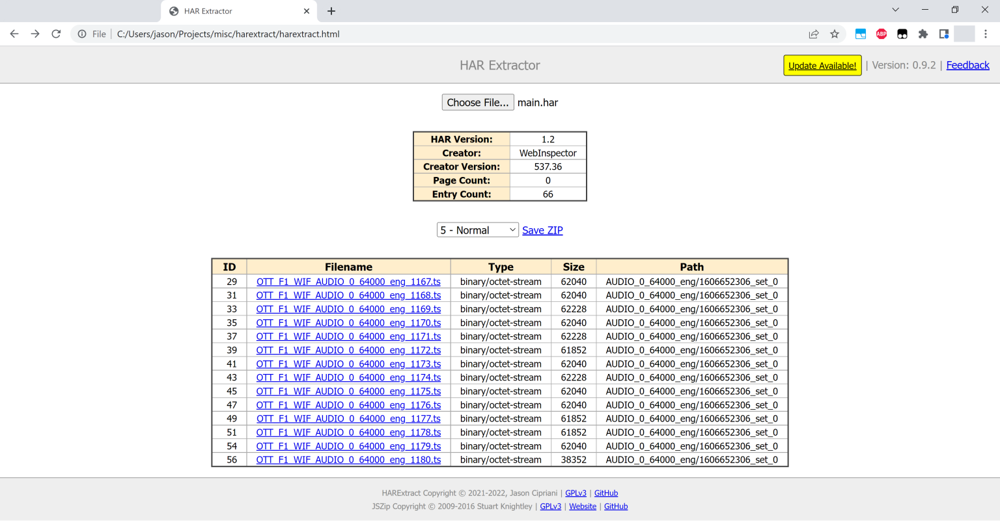

# harextract

Browser-based HAR extraction tool.

All you need is harextract.html -- it's completely self-contained and doesn't require
any online resources.

Open the page in a browser and use the file chooser button on the page to load a HAR
file. 

From there you can save individual files, and also save the entire collection as a ZIP
file:

It is extremely basic right now but may evolve over time.

## Bugs

Probably a ton. Written quickly and only tested on Chrome for Windows. Report them on
the issues page.

## License

    Copyright (C) 2021, Jason Cipriani <jason.cipriani.dev ~ gmail.com>
    HARExtract home page: https://www.github.com/JC3/harextract

    This program is free software: you can redistribute it and/or modify
    it under the terms of the GNU General Public License as published by
    the Free Software Foundation, either version 3 of the License, or
    (at your option) any later version.

    This program is distributed in the hope that it will be useful,
    but WITHOUT ANY WARRANTY; without even the implied warranty of
    MERCHANTABILITY or FITNESS FOR A PARTICULAR PURPOSE.  See the
    GNU General Public License for more details.

    You should have received a copy of the GNU General Public License
    along with this program.  If not, see <https://www.gnu.org/licenses/>.
    
    --------------------------------------------------------------------------
    
    HARExtract uses the library JSZip 3.7.1 released under the GPLv3 license.
    JSZip Copyright (C) 2009-2016 Stuart Knightley
    JSZip home page: https://stuk.github.io/jszip/
    JSZip license: https://github.com/Stuk/jszip/blob/v3.7.1/LICENSE.markdown